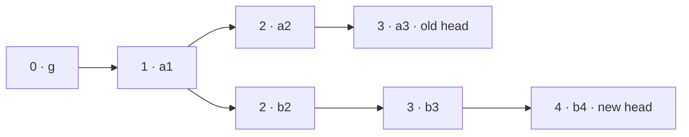

# Lab 6 — Make a Rust Indexer Survive a Reorg

An append-only indexer works until the chain changes its mind. This lab builds the smallest useful reorg model: two competing branches, a derived balance table, reversible block effects, and a restartable checkpoint.

There is deliberately no RPC client or database dependency. `MemoryChain` replaces the provider and a `BTreeMap` replaces the query store so the chain-reconciliation algorithm stays visible. The same boundaries later map onto Alloy and a transactional database.

## You need

- stable Rust and Cargo;
- about thirty minutes;
- no network connection or external crates.

## 1. Run the evidence first

From the repository root:

```bash
cd projects/reorg-indexer
cargo test
cargo run --quiet
```

The demo first indexes branch `a`, then receives `b4` as the new head:



Expected shape of the output:

```text
before reorg: tip=a3, balances={"alice": 6, "bob": 7}
reorg: rolled_back=2, applied=3
after reorg:  tip=b4, balances={"alice": 9, "carol": 7}
restart:      tip=b4, balances={"alice": 9, "carol": 7}
```

Bob's `7` does not survive because it came only from `a2` and `a3`. Keeping it while merely appending `b2..b4` would mix two incompatible histories.

## 2. Separate source data from the projection

Open `src/lib.rs`. Its four important types have different jobs:

- `Block` carries identity, parent identity, height, and decoded balance deltas;
- `MemoryChain` answers the question “give me the block with this hash”;
- `Indexer` owns the current canonical journal and query-shaped balances;
- `SyncReport` makes the destructive part of a reconciliation observable.

The deltas stand in for decoded canonical logs. A production implementation would key every record by at least chain, block hash, transaction hash, and log index. Block number alone cannot distinguish `a2` from `b2`.

## 3. Find the common ancestor by hash

`sync_to_head` walks backward from the reported head through `parent_hash` until it reaches a hash already in the local canonical journal.

For the graph above:

```text
b4 → b3 → b2 → a1
                 ↑ common ancestor
local tip: a3 → a2 → a1
```

Only after finding `a1` does the indexer know the exact work required:

```text
rollback: a3, a2
apply:    b2, b3, b4
```

Fetching only “block 2” is insufficient because two valid blocks can temporarily occupy that height. Parent hash and block hash make continuity testable.

## 4. Validate before changing the projection

Before touching balances, the implementation checks that every new block:

- points to the expected parent hash;
- increments height by exactly one;
- eventually connects to known canonical history.

The transition then runs on a cloned staging state. Only a complete rollback-and-apply replaces the live `Indexer`. In a production database, this boundary becomes one transaction containing the canonical journal, undo data, projection updates, and checkpoint move.

Crash safety is not “write the checkpoint last and hope.” All of those writes must commit or roll back together.

## 5. Make every block reversible

Applying a block adds its deltas. Rolling it back visits the same deltas in reverse order and applies their inverses.

This works for the deliberately additive projection. Real handlers often need richer undo data: the previous row value, deleted records, relationship changes, or a per-block change journal. Re-querying the old value after the reorg is too late if it has already been overwritten.

Run the focused test:

```bash
cargo test tests::rolls_back_the_old_branch_before_applying_the_new_one -- --exact
```

Then temporarily comment out the whole `while staged.canonical.len() > ancestor_position + 1` rollback loop and run the test again. The test should expose balances from both branches. Restore the loop after observing the failure.

## 6. Restart from enough information

`checkpoint()` persists the canonical block journal and its deltas, not only `tip = b4`. `from_checkpoint()` replays that journal to rebuild balances and validates every parent link and height on the way.

This makes the query table a rebuildable projection:

```text
canonical journal + deterministic handler → balances
```

A tip hash without rollback data is only a bookmark. It cannot explain how to undo a later reorg.

Run the restart test:

```bash
cargo test tests::resumes_from_a_checkpoint_and_keeps_syncing -- --exact
```

## 7. Check idempotency and failure behavior

Synchronizing to the current head returns zero work and leaves balances unchanged. An unknown parent returns an error without partially mutating state.

Those cases matter during retries. Providers time out, workers restart, and queues deliver duplicate work. “Exactly once” is usually built from atomic state plus idempotent identities, not granted by the network.

## 8. Replace the teaching seams in production

Keep the reconciliation core, then replace its edges:

| Lab boundary | Production boundary |
|---|---|
| `MemoryChain::block(hash)` | `eth_getBlockByHash` through an Alloy provider |
| `Vec<Block>` canonical journal | block table keyed by chain ID and block hash |
| inverse `Delta` | per-block undo journal or deterministic rebuild |
| cloned staging state | one database transaction |
| caller supplies `b4` | head subscription plus periodic canonicality checks |
| unlimited rollback history | retained reorg window plus an explicit safe/finalized policy |

Do not turn “six confirmations” or `finalized` into a magic constant hidden in a worker. Name the product decision: which data may be shown optimistically, which action waits for stronger finality, and what happens during delayed finalization.

## Artifact

Save a short design note containing:

- the two branch diagrams and their common ancestor;
- balances before and after reconciliation;
- the exact rollback and apply order;
- the five passing test names;
- one mutation that the reorg test caught;
- the atomic database transaction you would use in production;
- your retention and finality policy, with the consequence of exceeding it.

## Primary sources

- [EIP-1898](https://eips.ethereum.org/EIPS/eip-1898) — hash-pinned RPC reads and canonicality requirements.
- [Ethereum Execution APIs: blocks](https://github.com/ethereum/execution-apis/blob/main/src/eth/block.yaml) — normative block retrieval methods and parameters.
- [Reth Execution Extensions](https://reth.rs/exex/overview/) — canonical-chain notifications and commit/revert/reorg handling near an execution node.

Last verified: 2026-08-22.

## Check yourself

1. Why is a block number insufficient as the identity of indexed data?
2. Which hash is the common ancestor in the example, and in what order are blocks removed?
3. Why must rollback, replacement writes, and the checkpoint update share one database transaction?
4. What information does a restartable checkpoint need beyond the latest block number?
5. When may a system prune undo history, and what operational policy must accompany that choice?
