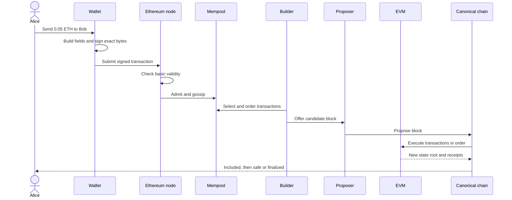
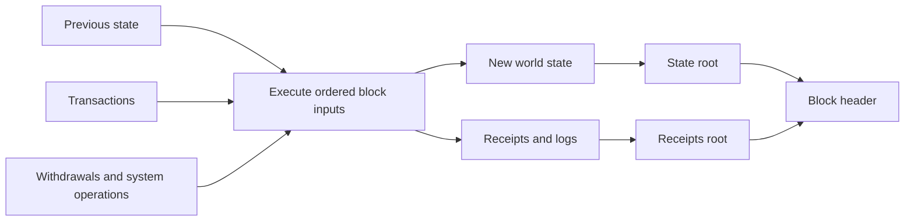

# One Transaction, End to End

> **A blockchain transaction is not a message that moves directly from one wallet to another. It is a signed request that travels through a network, competes for inclusion, executes against shared state, and becomes harder to reverse over time.**

Alice wants to send Bob `0.05 ETH`.

To Alice, this is a button. To Ethereum, it is a pipeline with several boundaries. A transaction may cross one boundary and fail at the next: it can be signed but never submitted, submitted but never included, included but reverted, or executed successfully and later removed by a reorganization.

This chapter follows the ordinary successful path first. The rest of the book explains why every step exists.



## 1. The wallet builds a request

The wallet does not start with a hash or a block. It starts with fields:

- the network identifier;
- Alice's next nonce;
- Bob's address;
- the amount;
- a gas limit;
- fee caps;
- empty call data, because this is a plain ETH transfer.

The wallet usually asks a node for the nonce and current fee conditions. That answer is useful, but it is not sacred. A stale nonce or poor fee estimate can leave the transaction waiting; neither changes what Alice is allowed to sign.

The important boundary is this:

> **The wallet prepares a proposal. The network decides whether that proposal is valid for the state in which it is eventually considered.**

The exact fields are covered in [A Transaction and Its Fields](007-transaction.md). Node access appears later in [JSON-RPC](049-json-rpc.md).

## 2. Alice signs bytes, not the screen

The wallet encodes the signing payload and asks Alice's key to sign it. The signature binds the authorization key to those exact bytes.

If someone changes Bob's address, the amount, the nonce, or a committed fee field, the signature no longer verifies for the modified payload.

That does not prove Alice understood the request. A malicious wallet can display “send 0.05 ETH to Bob” while preparing different bytes. Cryptography protects the boundary between signed bytes and network verification; it cannot protect the boundary between Alice's intention and a dishonest interface.

The result is a serialized transaction containing the signature. It still has not reached Ethereum.

Read [Private and Public Keys](018-private-public-key.md) and [Digital Signature of a Transaction](020-digital-signature.md) when you want to open this box.

## 3. A node decides whether to relay it

The wallet submits the signed transaction to an RPC node. The node performs inexpensive checks before accepting it into its local mempool:

- is the encoding valid?
- does the signature recover a sender?
- is the nonce usable under local pool rules?
- can the sender cover the transaction's maximum cost?
- is the fee competitive enough for this node to retain it?

A mempool is not a global waiting room. Each node has its own view and local policy. One node may retain a transaction that another drops. Gossip spreads accepted transactions, but there is no moment at which “the mempool” unanimously contains it.

At this point the transfer is pending. Bob does not yet have the ETH in canonical state.

The network path is expanded in [P2P, Gossip, and Discovery](038-p2p-gossip-discovery.md) and [Mempool](044-mempool.md).

## 4. Someone chooses an order

Transactions are not executed in arrival order. A builder assembles a candidate execution payload from public transactions, private order flow, and bundles. It must respect nonce dependencies and the block gas limit, but it also optimizes fees and other extractable value.

The order matters. If two transactions touch the same pool, auction, or contract storage, the first can change the result of the second. Ordering is part of the economic output of a blockchain, not a formatting detail.

In today's Ethereum block-production path, a proposer may choose a payload built locally or one offered through the builder market. Consensus selects who may propose for the slot; it does not dictate a fair transaction order inside the payload.

Later chapters separate [Mempool](044-mempool.md), [MEV](200-mev.md), and the [MEV Supply Chain](203-mev-supply-chain.md).

## 5. Every validating node executes the block

The proposed block reaches other nodes. They do not accept the builder's claimed balances. Each validating execution client runs the transactions in the agreed order against its own previous state.

For Alice's transfer, the transition includes:

1. check transaction-level validity;
2. advance Alice's nonce;
3. charge gas according to the rules;
4. subtract `0.05 ETH` from Alice;
5. add `0.05 ETH` to Bob;
6. produce a receipt;
7. include the result in the new state commitment.

The block does not carry a database dump saying “Bob now owns this much.” It carries inputs and commitments. Nodes derive the result independently and reject the payload if their computed result disagrees with the committed roots.



This is the central idea of [State and the State Transition Function](006-state-transition.md). The data structures behind the roots appear in [Merkle Tree and Merkle Proof](016-merkle-tree.md) and [State Root](035-state-root.md).

## 6. Included does not mean successful

Alice's plain transfer succeeds if the transaction is valid and Bob can receive the value under the applicable rules. A contract call has another possible outcome: execution can revert.

A reverted transaction is still included. It still occupies block space, advances the sender's nonce, and pays for the computation performed. Its receipt records failure, while the reverted call's state changes and logs do not survive.

This gives three different statements:

```text
the signature is valid
the transaction was included
the execution succeeded
```

None implies the next automatically.

## 7. Included does not mean permanent

After the block is proposed, fork choice may still select a competing branch. If Alice's block is removed, her transaction may return to a mempool or disappear, depending on what became valid in the new canonical state.

Applications therefore choose a confidence threshold. A low-value interface may react to inclusion. A bridge or exchange may wait for a stronger safety level. On Ethereum, `safe` and `finalized` describe consensus checkpoints with stronger guarantees than the current head.

Finality does not turn history into a mathematical constant. It makes reversal require a violation of stronger protocol assumptions and, in proof of stake, exposes large amounts of stake to penalties.

Read [Transaction Lifecycle](046-transaction-lifecycle.md), [Probabilistic Finality](047-probabilistic-finality.md), and [Economic Finality](048-economic-finality.md) for the failure paths.

## What actually moved?

No coin travelled through the internet as a file. Nodes accepted an authorized state transition:

```text
Alice.balance -= 0.05 ETH + fees
Alice.nonce   += 1
Bob.balance   += 0.05 ETH
```

The useful mental model is not “a digital coin moved.” It is:

> **A network agreed on an ordered input, independently applied the same rules, and converged on a new canonical state.**

The next chapters take this pipeline apart. Keep returning to it. Hashes, signatures, mempools, consensus, gas, execution, MEV, and finality are not separate inventions; they are answers to different failure points in this one journey.

## Primary sources

- [Ethereum Execution APIs](https://ethereum.github.io/execution-apis/) — transaction submission, transaction objects, receipts, and execution-client RPC boundaries.
- [Ethereum Execution Layer Specifications](https://github.com/ethereum/execution-specs) — validation and deterministic execution of ordered transactions.
- [Ethereum consensus fork-choice specification](https://github.com/ethereum/consensus-specs/blob/master/specs/phase0/fork-choice.md) — head selection, justified checkpoints, and finalized checkpoints.

Last verified: 2026-08-22.

## Check yourself

1. At which step does Alice authorize exact bytes?
2. Does mempool admission guarantee inclusion?
3. Who computes Bob's new balance: the proposer or every validating node?
4. How can a transaction be included but unsuccessful?
5. What stronger statement does finality add beyond inclusion?

<!-- corepath:start -->

**Core Path 1/50** · [← The Core Path](../core-path.md) · [State and the State Transition Function →](006-state-transition.md)

<!-- corepath:end -->
