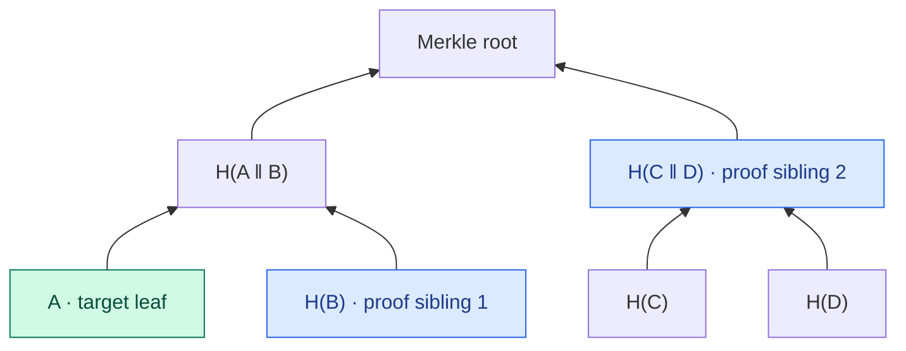

# Merkle Tree and Merkle Proof

> **A Merkle tree proves that a leaf is included at a particular position in a committed structure by providing a short path of hashes instead of transmitting the entire structure.**

## How the tree is built

1. Encode and hash the data according to the tree's leaf rules.
2. Combine neighboring hashes in the prescribed order and hash them according to the internal-node rules.
3. Apply the tree's rule for an incomplete level—duplication, promotion, padding, or another scheme—and repeat until only one hash remains: the Merkle root.

The exact encoding and node-domain rules are part of the construction. A secure implementation must not let the same bytes be interpreted ambiguously as either a leaf or an internal node.

Changing any leaf changes the entire path above it and ultimately the root. In a balanced binary tree with a power-of-two number of leaves, eight leaves give a three-step path and 1,024 give ten. More generally the proof length is on the order of `log₂(n)`, with exact details determined by the tree's balancing and padding rules.

Ethereum's `transactionsRoot` serves the same role as a commitment to the ordered transaction list, but is built using the more complex Merkle Patricia Trie, keyed by each transaction's encoded index.

## How a proof works

To prove the presence of X, provide:

- X itself or its hash;
- one neighboring hash from each level;
- the `left/right` order, explicitly or through the leaf index.

Order matters: `H(current ‖ sibling)` and `H(sibling ‖ current)` are generally different.

For a four-leaf tree, a proof for `A` carries only `H(B)` and `H(C ‖ D)`. The verifier must also know that `A` was on the left at both steps:



The verifier works upward from X to the root and compares the result with the known root. A balanced binary tree of 1,024 leaves requires 10 neighboring hashes, not the entire structure.

`eth_getProof` uses exactly this idea: a node returns a path to an account or storage key relative to a particular `stateRoot`, not the entire state.

## What a proof actually proves

A matching root means only:

> **X appears at the claimed path or position in the structure committed to by root R.**

A proof does not show that R comes from a canonical block. Consensus or an independently verified chain supplies a trusted root.

An ordinary membership proof is also insufficient to prove absence. Non-membership requires additional rules: ordering, predetermined empty leaves, or a trie whose path can be shown to terminate. This is why `eth_getProof` can also prove the absence of a value.

## A Bitcoin bug: CVE-2012-2459

When there is an odd number of nodes, Bitcoin duplicates the last one. As a result, the lists

```text
[1,2,3,4,5,6]
[1,2,3,4,5,6,5,6]
```

produce the same Merkle root without breaking SHA-256.

The version containing duplicates passed root verification, but the block itself was invalid. If a node received it first, it could mark the shared block hash as invalid and later reject the correct version with the same hash. The result was a denial of service.

The fix taught Bitcoin Core to detect this tree mutation separately. The lesson is simple: security depends not only on the hash but also on the precise rules used to construct the data structure.

## Bitcoin and Ethereum

- Bitcoin uses a binary Merkle tree over transaction IDs and duplicates the last hash whenever a level has an odd number of nodes.
- Ethereum state uses a Merkle Patricia Trie: account paths are derived from `keccak256(address)`, storage paths from `keccak256(slot)`, and a proof consists of the required encoded trie nodes.

The common principle is to reconstruct a path to a trusted root. The specific proofs are incompatible.

## Primary sources

- [Bitcoin whitepaper](https://bitcoin.org/bitcoin.pdf) — binary transaction Merkle trees and pruning with branch proofs.
- [Bitcoin Core Merkle implementation](https://github.com/bitcoin/bitcoin/blob/master/src/consensus/merkle.cpp) — odd-leaf duplication and mutation detection.
- [EIP-1186: `eth_getProof`](https://eips.ethereum.org/EIPS/eip-1186) — Ethereum account and storage proofs against state commitments.

## Check yourself

1. How many neighboring hashes are needed for a tree with 4,096 leaves?
2. Why does a proof store the `left/right` direction?
3. What does matching a root prove, and what does it not prove?
4. Why was CVE-2012-2459 not a break of SHA-256?
5. What additional structure is required to prove that an item is absent?

<!-- corepath:start -->

**Core Path 11/50** · [← Cryptographic Hash Function](014-hash-properties.md) · [Asymmetric Cryptography →](017-asymmetric-crypto.md)

<!-- corepath:end -->
