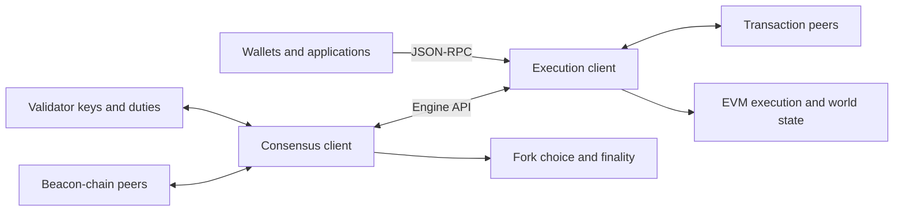

# Execution and Consensus Clients

> **Post-Merge Ethereum splits one node into two programs: consensus chooses the chain, execution computes its state.**

The consensus client follows beacon blocks, validates consensus-layer data and signatures, and applies fork choice, justification, and finality. A separate validator component, when configured, performs duties such as attesting and proposing.

The execution client handles Ethereum transactions. It normally maintains a transaction pool and world state, runs the EVM, validates execution payloads, can serve JSON-RPC, and can build local candidate payloads.

Together they form one Ethereum node:



The Engine API is a private control boundary. JSON-RPC is an application-facing boundary; confusing them is both an architectural and an operational mistake.

## How validation splits

When the consensus client receives a beacon block, it checks the consensus-layer parts and sends the embedded execution payload to the execution client.

The execution client checks transaction and block rules, runs the payload, and reports whether it is valid. A block needs both layers to accept their respective parts.

During local block production, the consensus client supplies a chosen parent and payload attributes through `engine_forkchoiceUpdated`, then retrieves the execution client's candidate with `engine_getPayload`. A proposer using an external builder may obtain the payload through a Builder API path instead of selecting the local execution client's payload.

## Why the split exists

Ethereum added proof-of-stake without replacing the mature execution ecosystem. The boundary also allows several independent implementations on each side.

Client diversity reduces the chance that one software bug controls the whole network, but only when operators use different implementations. Having several codebases available is not enough.

## Operational consequence

A healthy node needs both clients synced, authenticated to each other, configured for the same network and fork, and connected through the Engine API.

If consensus is healthy but execution is stuck, the pair cannot fully validate new execution payloads, even if the consensus client can temporarily advance optimistically. If execution is healthy but consensus has no canonical head, RPC may expose stale state.

Remember:

```text
consensus → which ordered blocks count?
execution → what do their transactions do?
```

## Primary sources

- [Ethereum node architecture](https://ethereum.org/developers/docs/nodes-and-clients/node-architecture/) — the execution-client, consensus-client, validator, JSON-RPC, and Engine API boundaries.
- [Ethereum Execution APIs: Engine API](https://github.com/ethereum/execution-apis/tree/main/src/engine) — the versioned interface between consensus and execution clients.

Last verified: 2026-08-22.

## Check yourself

1. Which client applies fork choice and finality?
2. Which client executes EVM transactions?
3. What connects the two clients?
4. Why is client diversity an operational property?
