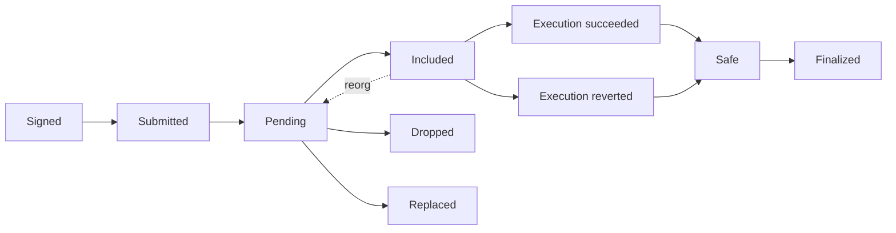

# Transaction Lifecycle

> **A transaction moves through signing, propagation, inclusion, execution, and finality—each is a different state.**

[One Transaction, End to End](000-one-transaction.md) followed the successful story. Operational software needs the state machine around it: a signed transaction can be submitted, remain pending, be replaced or dropped, enter a block, revert during execution, and later leave canonical history in a reorg.

The names are observations with different evidence. “Submitted” may mean only that one RPC node accepted bytes; “included” requires a canonical block and receipt; “finalized” belongs to consensus, not the mempool or EVM.

## From pending to included

A builder selects and orders transactions for a candidate block. Selection depends on fees, nonce dependencies, gas limits, bundles, and validity against the chosen parent state.

When the block is proposed and accepted by fork choice, the transaction becomes included. Execution produces a receipt containing status, gas used, and logs. If the call reverts, its state changes and logs roll back, but the included transaction still consumes gas, increments the sender nonce, and records a failed status.

`Safe` and `finalized` describe the canonical block containing the outcome; they do not change a reverted execution into a successful one.

## Replacements and drops

Before inclusion, an Ethereum sender can issue another transaction with the same nonce and a sufficient fee increase. Nodes may replace the old pool entry according to local policy, but replacement is not a global protocol event until one same-nonce transaction is included and makes the alternatives stale.

A pending transaction can also disappear from one node because of eviction, restart, fee policy, or invalidation. Resubmission and monitoring should use the transaction hash, sender nonce, and canonical receipts—not one provider's “pending” flag.

## Reorgs

An included transaction can return to pending or disappear if its block is reorged out. Applications wait for an appropriate confirmation, safe, or finalized level based on the value at risk.

Operational software should track three different facts: whether the transaction was authorized, what its canonical receipt says about execution, and how strongly consensus protects the containing block from reversal. One boolean named `confirmed` cannot represent all three safely.

## Primary sources

- [Ethereum transactions](https://ethereum.org/developers/docs/transactions/) — transaction fields, signing, gas, and the distinction between transactions and contract execution.
- [Ethereum JSON-RPC specification](https://ethereum.github.io/execution-apis/) — canonical transaction and receipt methods and response objects.

Last verified: 2026-08-22.

## Check yourself

1. Which fields are fixed before signing?
2. How can an included transaction still fail?
3. What does same-nonce replacement do?
4. Why is a receipt not automatically finality?

<!-- corepath:start -->

**Core Path 6/51** · [← A Block and the Transactions Inside It](008-block.md) · [Ethereum World State →](034-ethereum-world-state.md)

<!-- corepath:end -->
