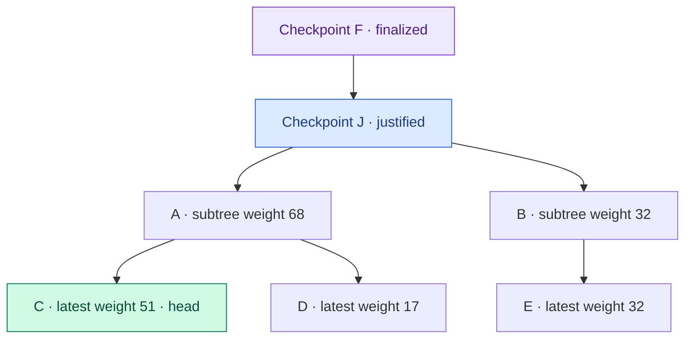

# LMD-GHOST and Casper FFG

> **LMD-GHOST chooses Ethereum's current head; Casper FFG finalizes checkpoints so deep history cannot normally be reverted.**

One attestation carries both a head vote and a checkpoint vote. Those votes feed two rules answering different questions:

```text
Which recent branch should we build on now?
Which older checkpoint is final?
```

LMD-GHOST answers the first. Casper FFG answers the second.

## LMD-GHOST: head selection

Starting from a justified checkpoint, the fork-choice rule examines competing child branches and follows the one with the greatest supporting attestation weight, repeating until it reaches a head.

LMD means “latest message driven”: only each validator's latest relevant vote counts, so one validator cannot multiply weight by repeating old votes. GHOST means the rule follows the heaviest observed subtree rather than simply the longest branch.

The head can change as attestations arrive. It is the best current tip, not an irreversible decision.

The numbers below are illustrative latest-vote weights. Starting from justified checkpoint `J`, fork choice follows the heavier subtree at each branch until it reaches `C`. Finalized checkpoint `F` is a different, older boundary:



## Casper FFG: checkpoint finality

Validators also vote between epoch checkpoints. A supermajority link can justify a checkpoint, and a later qualifying link can finalize it.

Finalizing conflicting checkpoints would require many validators to violate slashable voting rules. That gives finalized history an explicit economic defense.

## Why both are needed

Fork choice keeps the chain moving block by block. Finality provides a stronger boundary for applications and prevents ordinary fork choice from rewriting old checkpoints.

During poor participation, LMD-GHOST may continue selecting a head while Casper stops finalizing. The chain can therefore have recent blocks without fresh economic finality.

Client implementations must combine both rules with proposer boost, justified checkpoints, and fork-specific details exactly as specified. The simple model remains:

```text
LMD-GHOST → best live branch
Casper FFG → finalized historical boundary
```

## Primary sources

- [Ethereum consensus specification: Fork choice](https://github.com/ethereum/consensus-specs/blob/master/specs/phase0/fork-choice.md) — the latest-message-driven GHOST store, justified checkpoints, proposer boost, and head selection.
- [Ethereum consensus specification: Beacon Chain](https://github.com/ethereum/consensus-specs/blob/master/specs/phase0/beacon-chain.md) — checkpoint votes, justification, finalization, and slashable attestation conditions.

Last verified: 2026-08-22.

## Check yourself

1. Which rule chooses the current head?
2. Why does only a validator's latest message count?
3. What does Casper FFG finalize?
4. How can blocks continue while finality stalls?

<!-- corepath:start -->

**Core Path 26/50** · [← Ethereum PoS: Slots, Epochs, and Attestations](062-ethereum-pos-slots-epochs-attestations.md) · [Probabilistic Finality →](047-probabilistic-finality.md)

<!-- corepath:end -->
