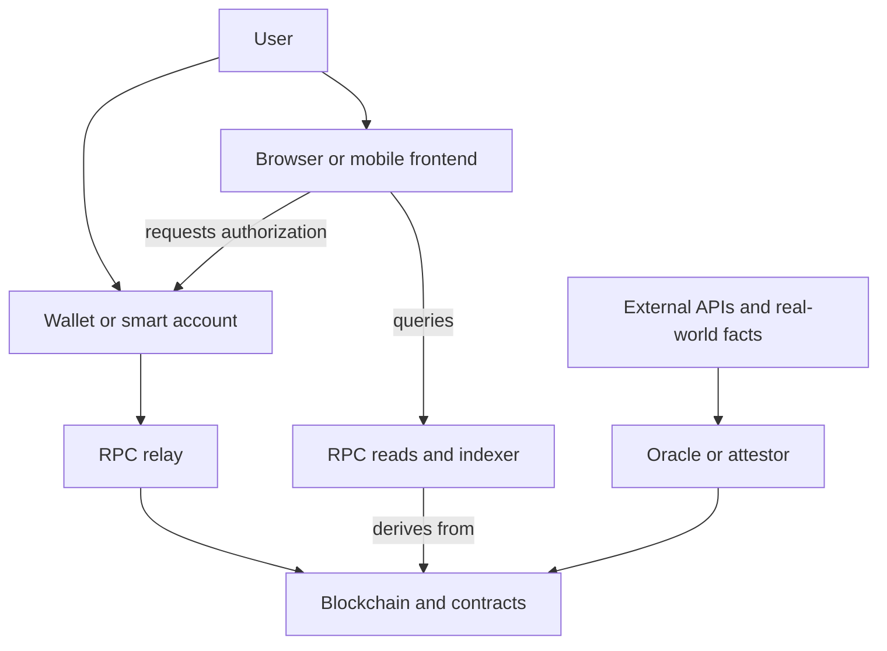

# Web2, Web3, and the Architecture of a Dapp

> **A Web3 application does not replace the web. It moves authority over selected state changes from one operator's server to rules and state that independent participants can verify. The rest of the product may still be conventional Web2 infrastructure.**

## The labels are shorthand

`Web2` and `Web3` are not protocol versions with a universal compliance test. This book uses them as engineering shorthand:

- a **Web2 application** treats an operator's servers, business logic, and database as the final authority over application state;
- a **Web3 application**, or **dapp**, makes a blockchain and its contract or protocol rules authoritative for some security-critical state and transitions.

The boundary is not the visual interface. A site can connect a wallet while keeping every meaningful balance and permission in a private database. Another product can expose contracts that remain usable through a different frontend after the original company disappears.

Most production dapps are hybrids. The useful question is not “is this Web3?” but:

> **Which state and decisions have moved out of one operator's unilateral control, and which have not?**

## One action, two control paths

Suppose Alice swaps one asset for another.

In a conventional exchange application, the path is roughly:

```text
browser → authenticated API → server checks private policy
        → company database changes balances
```

The company decides which request format is valid, which policy applies, and which database record is authoritative. Replicas and data centers improve availability, but they remain under one administrative boundary. An authorized operator can freeze the account, reverse an internal record, deploy new logic, or refuse the request.

In an on-chain exchange, the critical write follows another path:

```text
browser → wallet authorizes exact call data → RPC relays transaction
        → network orders it → contract rules execute
        → validating nodes derive the new canonical state
```

The frontend proposes an action; it does not update the pool's canonical balances. The transaction succeeds only if the signature, contract rules, and chain state permit it when execution occurs.

This does not make the interface harmless. A compromised frontend can prepare a call to the wrong contract or request an [unlimited approval](138-approve-allowance-unlimited-approval.md). The signature binds Alice to the encoded request, not to what the screen claimed it meant.

## What actually changes

| Boundary | Conventional Web2 application | Web3 application path |
|---|---|---|
| Source of truth | Operator-controlled database | Canonical chain state derived under protocol rules |
| Authorization | Password, passkey, session, OAuth token, or server-side policy | Transaction signature or [smart-account](169-erc-4337.md) validation for on-chain writes |
| Business logic | Server code chosen by the operator | Contract code and protocol rules executed by validating nodes |
| Accepting a write | The server accepts and commits it | The network includes a valid request and execution succeeds |
| Reading state | The application's API returns its database view | An [RPC](049-json-rpc.md) or [indexer](051-indexers-the-graph.md) returns a chain-derived view, which may need independent verification |
| Recovery and changes | An administrator can edit data, reset access, or roll back internal records | A new valid transition, an authorized upgrade, governance action, or exceptional social intervention is required |
| Privacy | Data can remain private to the service, although the operator can see it | Public-chain state is normally public; an address is [pseudonymous, not private](268-pseudonymity-vs-anonymity.md) |
| Cost and latency | Centralized execution can be fast and cheap to operate per request | Replicated verification, ordering, gas, and finality add cost and delay |

The Web3 column describes the on-chain path, not every screen or service around it. A wallet may still create a normal web session. An application may keep preferences, search indexes, notifications, and analytics in ordinary databases. The architectural shift matters only where the blockchain becomes the authority.

## The real dapp is a hybrid system



Each component supplies a different claim:

- the **frontend** describes what it wants the user to do;
- the **wallet** authorizes encoded bytes or [smart-account logic](173-safe-and-smart-wallets.md);
- the **[RPC provider](050-node-providers.md)** relays writes and reports a node's view;
- the **indexer** organizes derived history for fast queries;
- the **contracts and chain** determine accepted on-chain state;
- an **oracle** makes an external claim available to contracts.

An [oracle](193-oracle-problem.md) can supply an input to an on-chain transition, but consensus can only reproduce the submitted value; it cannot prove that the external fact was true. The frontend, wallet, RPC provider, and indexer remain separate access and presentation boundaries.

## Measure decentralization layer by layer

Three tests expose where control remains.

**Disappearance test.** If the company closes today, can users still read the relevant state, call the contracts, and exit with their assets?

**Substitution test.** Can another team replace the frontend, RPC provider, indexer, or relayer without permission from the original operator?

**Authority test.** Which keys or organizations—such as an [admin multisig](229-timelocks-and-multisigs.md)—can pause contracts, upgrade code, change fees, censor access, replace an oracle, or move assets?

A system can pass one test and fail another. Contracts may be permissionless while the only convenient frontend blocks users. The frontend may be replaceable while a single upgrade key can replace all contract logic. Thousands of nodes do not decentralize an issuer that can freeze the underlying asset.

These tests complement the architectural, political, and logical distinctions in [Centralization, Distribution, and Decentralization](003-centralization-decentralization.md). For example, a [sequencer](156-sequencer-and-centralization.md) may be a centralized ordering boundary even when contract execution is independently verified.

Use layer-specific language:

```text
contract execution is independently verified;
the sequencer can censor temporarily;
frontend hosting is replaceable;
one company operates the default RPC;
the oracle uses a named committee;
an admin multisig can upgrade the contracts.
```

That describes a threat model. “The app is decentralized” does not.

## Where the Web3 guarantee ends

Moving state on-chain does not guarantee that:

- the frontend displays the transaction honestly;
- the user understood the bytes they authorized;
- contract rules are correct or economically safe;
- an RPC or indexer reports complete, canonical data;
- an oracle, bridge, stablecoin issuer, or admin key is decentralized;
- the application remains available through its default website;
- public data is anonymous or private.

The chain guarantees only what its rules, code, and assumptions actually cover. Every off-chain dependency introduces another boundary.

## When Web2 is the better design

If one organization is already the accepted authority, a conventional database is usually simpler. It offers lower latency, private records, inexpensive writes, straightforward correction, and familiar support and recovery paths.

Do not put data on-chain merely to make the product sound decentralized. Use a blockchain when independent parties need to verify and act on shared state without granting one operator unilateral authority. Keep private, high-volume, easily recomputed, or non-critical data off-chain unless a specific guarantee requires otherwise.

The engineering choice is often hybrid:

```text
put authority-critical state on-chain;
keep presentation and replaceable computation off-chain;
make every dependency and escape path explicit.
```

## Primary sources

- [Ethereum Execution APIs](https://ethereum.github.io/execution-apis/) — the standard RPC boundary for reading chain data and submitting signed transactions.
- [Ethereum Execution Layer Specifications](https://github.com/ethereum/execution-specs) — validation and deterministic state-transition rules executed by Ethereum nodes.
- [EIP-1193: Ethereum Provider JavaScript API](https://eips.ethereum.org/EIPS/eip-1193) — the provider interface through which applications request accounts, reads, and wallet-mediated actions.
- [EIP-20: Token Standard](https://eips.ethereum.org/EIPS/eip-20) — the standard allowance and approval mechanism behind ERC-20 approval risk.
- [EIP-1967: Proxy Storage Slots](https://eips.ethereum.org/EIPS/eip-1967) — standardized implementation, beacon, and admin slots that expose concrete upgrade authority boundaries.
- [Vitalik Buterin, “The Meaning of Decentralization”](https://medium.com/@VitalikButerin/the-meaning-of-decentralization-a0c92b76a274) — the original architectural, political, and logical decomposition used to reason about decentralization.

Last verified: 2026-08-23.

## Check yourself

1. What makes an operator's database authoritative in a Web2 application, and what replaces that authority for an on-chain state change?
2. A website connects a wallet but keeps every balance and permission in its private database. Which Web3 property has it actually gained?
3. Why can a dapp have decentralized contract execution and still fail when one company goes offline?
4. What does a wallet signature prove, and why can a compromised frontend still cause loss?
5. Which application data belongs on-chain, and which properties make data a better fit for an ordinary database?

<!-- corepath:start -->

**Core Path 2/51** · [← One Transaction, End to End](000-one-transaction.md) · [State and the State Transition Function →](006-state-transition.md)

<!-- corepath:end -->
