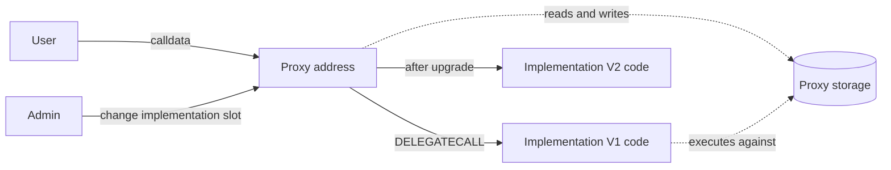

# Proxies and Upgradeability: Transparent and UUPS

> **An upgradeable proxy keeps the public address and storage stable while changing the implementation code executed through `DELEGATECALL`.**

## The basic pattern

Users call the proxy. Its fallback loads an implementation address and delegates the calldata:

Because `DELEGATECALL` uses the proxy's context, implementation code reads and writes proxy storage. Upgrading changes the implementation pointer, not user balances to a new address.

Special ERC-1967 slots keep the implementation and admin pointers away from ordinary compiler-assigned storage.

## Constructors become initializers

The implementation's constructor runs only in the implementation's own storage. It does not initialize proxy state.

Upgradeable contracts use an external initializer executed through the proxy. It must be callable exactly as intended—normally once—and proxy deployment should initialize atomically. An open initializer can let an attacker become owner.

## Transparent proxy

A Transparent proxy contains admin routing logic in the proxy. The admin can perform upgrades but is prevented from falling through to implementation functions; ordinary users are delegated normally.

This avoids clashes where an implementation function accidentally shares a selector with a proxy admin function. The tradeoff is a heavier proxy and a separate ProxyAdmin control path.

## UUPS proxy

A UUPS proxy is thinner. Upgrade functions live in the implementation code and update the proxy's ERC-1967 implementation slot during delegated execution.

The implementation must correctly authorize upgrades and remain compatible with the UUPS mechanism. A bad implementation can expose upgrades or permanently remove the path.

## Upgradeability's real cost

Upgrades fix bugs and evolve products, but introduce governance power, storage-compatibility constraints, initialization risk, and implementation-key risk.

“Audited contract” is incomplete if an admin can replace all its logic tomorrow. Users must evaluate the upgrade authority, timelock, monitoring, and exit window.

## Primary sources

- [ERC-1967: Proxy Storage Slots](https://eips.ethereum.org/EIPS/eip-1967) — standardized implementation, beacon, and admin slots.
- [ERC-1822: Universal Upgradeable Proxy Standard](https://eips.ethereum.org/EIPS/eip-1822) — the UUPS pattern, compatibility check, and upgrade hazards.

## Check yourself

1. Whose storage does implementation code use through a proxy?
2. Why does an implementation constructor not initialize proxy state?
3. Where does upgrade logic live in Transparent versus UUPS patterns?
4. Why does upgradeability expand the trust model?
