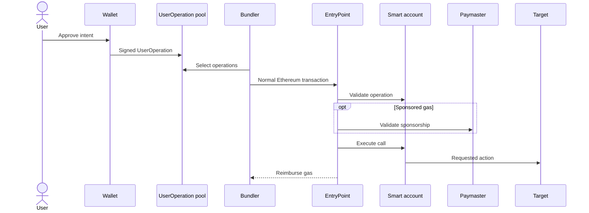

# ERC-4337: UserOperation, Bundler, and EntryPoint

> **ERC-4337 gives smart accounts a transaction-like flow without changing Ethereum's consensus transaction format.**

Rollups change where execution happens. Account abstraction changes a different boundary: who may authorize an action and who pays to place it on-chain.

## The separate pipeline

A user signs a `UserOperation`, not a normal Ethereum transaction. It describes the smart account, nonce, call data, gas limits, fee terms, and optional deployment or sponsorship data.

The flow is:

A bundler selects operations and submits a normal transaction to the shared `EntryPoint` contract. The bundler pays that outer transaction's gas, then gets reimbursed from account deposits or a paymaster.

## Validation and execution

The EntryPoint asks each smart account to validate its operation. The account can require one key, multiple owners, passkeys, a session key, or another signature scheme.

If validation succeeds, the EntryPoint executes the requested call. Validation and execution are separated so bundlers can simulate an operation before spending gas on it.

## Counterfactual accounts

A user can know a smart-account address before deploying its code. The first UserOperation may include factory data that creates the account, then executes the call.

This enables onboarding where a user receives assets before the account contract exists on-chain.

## What 4337 does not mean

It does not turn every EOA into a smart account. It creates an application-level transaction system implemented through contracts, bundlers, and an alternative operation pool.

It also does not remove trust analysis. Inspect the account implementation, EntryPoint version, bundler censorship, paymaster policy, upgrade keys, and recovery rules.

The key distinction: Ethereum validators still include an ordinary transaction; inside it, the EntryPoint processes many programmable account operations.

## Primary sources

- [ERC-4337: Account Abstraction Using Alt Mempool](https://eips.ethereum.org/EIPS/eip-4337) — `UserOperation`, EntryPoint, bundler, paymaster, factory, validation, and execution rules.

Last verified: 2026-08-22.

## Check yourself

1. Is a UserOperation a native Ethereum transaction?
2. Who submits the outer transaction and initially pays its gas?
3. Which contract coordinates validation and execution?
4. How can an undeployed account receive and later spend assets?

<!-- corepath:start -->

**Core Path 49/50** · [← Data Availability](158-data-availability.md) · [Smart Contract Threat Model →](215-smart-contract-threat-model.md)

<!-- corepath:end -->
