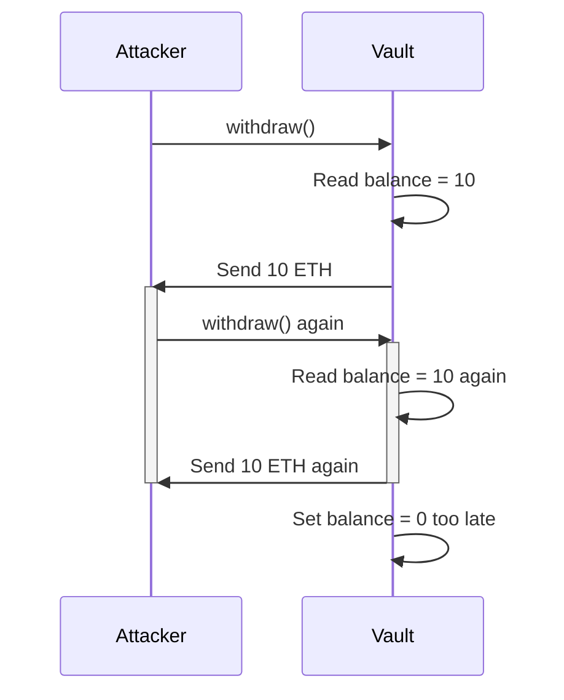

# Reentrancy

> **Reentrancy happens when a contract yields control while an operation's invariants are not fully restored, and external code calls back into that temporary state.**

## The classic withdrawal

Imagine this order:

```text
1. read Alice's balance
2. send ETH to Alice
3. set Alice's balance to zero
```

Step 2 executes code if Alice is a contract. Its receive function calls `withdraw()` again. Because step 3 has not happened, the nested call sees the same balance and sends again.



The EVM is single-threaded, but calls are nested. Reentrancy is logical interleaving inside one transaction, not parallel execution.

## More than one function

The callback may enter another public function that reads the same inconsistent state. It may cross several contracts or tokens with hooks. Guarding only the obvious withdrawal function can leave a cross-function path open.

The real unit of protection is the invariant shared by those functions.

Not every exploit repeats a state-changing withdrawal. In **read-only reentrancy**, a callback observes a temporarily inconsistent price, balance, or exchange rate and another protocol acts on that value. A `view` function can therefore participate in an exploit even though it does not write state itself.

## Defenses

Use checks–effects–interactions: validate, update internal accounting, then call external code. A revert rolls the early update back if the call fails.

A reentrancy guard rejects nested entry into protected paths. Pull-payment designs let each recipient withdraw separately instead of calling many recipients during core accounting.

None replaces reasoning. A guard on function A does not protect function B unless they share the same lock; updating one variable early may leave another invariant temporarily broken.

## External means adversarial

ETH transfers, ERC-777-style hooks, NFT receiver callbacks, arbitrary routers, and even trusted-looking upgradeable contracts can execute code.

Treat every external call as a point where control leaves and may return through any reachable entry point.

## Try it

[Lab 4 — Exploit and Repair Reentrancy](../labs/04-reentrancy-and-cei.md) turns one outer withdrawal into a visible nested call trace, then runs the same caller against a checks–effects–interactions vault.

## Primary sources

- [Solidity security considerations: Reentrancy](https://docs.soliditylang.org/en/latest/security-considerations.html#reentrancy) — callback mechanics, vulnerable code, and checks–effects–interactions.

## Check yourself

1. Which ordering mistake enables the classic withdrawal attack?
2. Why is reentrancy possible on a single-threaded EVM?
3. How can a callback reenter through a different function?
4. What invariant should a reentrancy guard protect?
